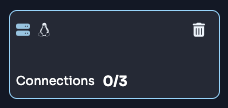
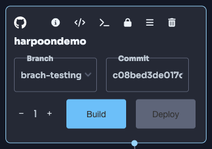
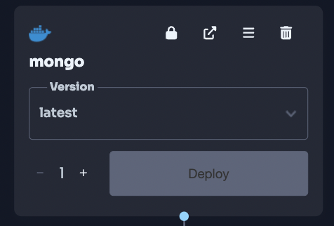
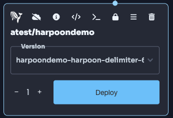
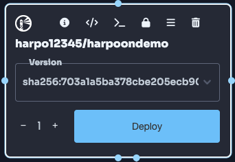
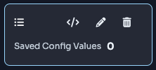
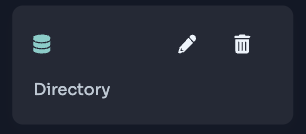
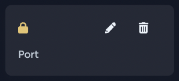
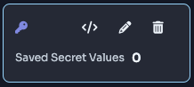
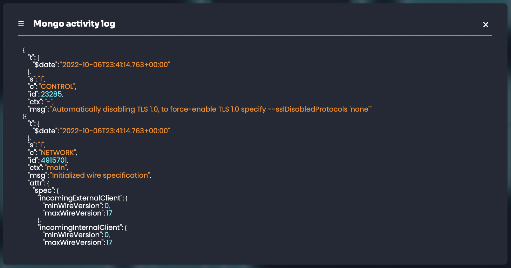

========
Features
========

.. _elements:

Elements
========
Every element depicted below has a visual representation of what state the element is in, excluding the link
elements, log elements and cloud controller element. Translucent represents the element has no state and is waiting to be activated.
Yellow represents the element that is in the process of being deployed. Blue represents a successful deployment
and is running successfully. Red represents a failed deployment and error state.

Cloud controller Element
------------
The Cloud Controller Element is a visual representation of how you control your cluster's state and obtain information about the currently deployed cluster. Starting the cluster with the play button will initiate Terraform scripts that build a given cluster in the user's chosen cloud service provider or on-premises environment. Stopping the cluster with the power button will initiate Terraform scripts that tear down the given cluster and any associated resources. The frontend calls a backend service, which contains the underlying logic required to execute and fulfill the user's requests. This backend service manages these machines and their supporting infrastructure using HashiCorp Terraform. It dynamically generates the required inputs for Terraform based on the user's requested state. These inputs are injected into the Terraform execution environment using environment variables.

The backend service executes Terraform within this environment by copying the generated Terraform files into a temporary directory, injecting the saved state for Terraform, setting up the environment variables, and executing Terraform. It then captures all output from Terraform to monitor for errors and to communicate progress to the frontend. Once Terraform completes, the backend service saves any necessary outputs, including secrets and state, for future changes. The deployed cluster includes a set of base services and is configured to dynamically interact with the underlying cloud provider. This allows for automated provisioning of volumes, services, and other cloud-native services directly from within the cluster. Additionally, this setup enables features such as autoscaling and other functionalities that require integration between the cloud provider and the Kubernetes cluster managed by harpoon.

The information icon on the Cloud Controller Element displays the cluster's cloud provider, number of nodes, harpoon IAC version, Kubernetes version, cluster state, and any errors. The upgrade cluster icon initiates Terraform scripts to update your existing cluster to the latest harpoon IAC version using Terraform.

.. image:: ../images/cluster-controller.png
   :width: 300
   :align: center

Node Element
------------
The Node Element is a visual representation of a virtual machine running within a user's cloud service provider account. Multiple nodes constitute a cluster. This cluster can be scaled up by adding more available nodes if the user has any at their disposal. Conversely, the cluster can be scaled down by deleting a node. Up to three elements may be attached to a given node at any one time.

The Node Element maps to a set of machines that together form a Kubernetes cluster. Users can change the OS type of a node by clicking on the OS icon displayed on the node. Currently, harpoon only supports Windows nodes on Azure AKS clusters.

Git Element
-----------
The git element is a visual representation of a git repository which can be either a public or private repository.
A given git repository can be built with a pre-existing docker file or write their own build commands and choose
their own operating system to build the repository.

Docker Element
-----------------
The docker element is a visual representation of a docker container image that can be deployed to a cluster.
When a user calls for the deployment of a container on the frontend, a backend service is called to process the request. 
The frontend passes the image and configuration information to the backend for the creation of the container. harpoon
stores the kubeconfig required to connect and interact with a cluster so that requests can be made directly to the cluster.
The backend service takes the information provided by the frontend and dynamically generates a set of Kubernetes manifests
to allow for the deployment of the container to the running cluster. The exact manifests generated vary based on the exact
nature of the request from the frontend but generally, a Kubernetes Deployment object is created to instruct the cluster to
deploy the container. The backend service then deploys these manifests to the cluster using its API and then watches for a 
successful or unsuccessful deployment of the container. The state and status of the deployment is communicated to the frontend
to show the user what the state of their request is.

Harpoon container Element
-----------
The harpoon container element is a visual representation of an image pushed to the private harpoon container registry.
To see how to get harpoon container elements please see the Auto deployments section at the bottom of this page.

Harbor conatiner Element
-----------
The harbor container element is a visual representation of a harbor image from the users linked harbor account.

Link Element
------------
The link element is a visual representation of a link between elements on the graph.
Links are attached by dragging from one element to another until the second element is selected.
A link represents a relationship between elements and how they are deployed in Kubernetes. Each element is
outlined below.

ConfigMap Element
-----------------
The config map element is a visual representation of Kubernetes ConfigMaps. A ConfigMap in Kubernetes
is a Key/Value pair. ConfigMap elements can only be attached to git or container elements.
When a ConfigMap element is attached to a git or container element, it modifies the deployment descriptor for the
relevant Kubernetes pod that is already deployed in the Kubernetes cluster and then executes a command in Kubernetes
to update the configuration for that deployment using the Kubernetes API. Much like the Container deployments,
the frontend makes a call to the backend which generates the required manifests and pushes them to Kubernetes
dynamically on behalf of the user. The backend service also modifies the associated container deployment to
expose the created ConfigMap, in the user-specified manner, to the running container deployment.

Volume Element
--------------
The Volume element is a visual representation of a Kubernetes Persistent Volume Claim (PVC) for a
given git or container element. Users can input the volume directory location inside a Kubernetes Pod where the
data will be replicated to a distributed volume in the cloud.  Volume elements can only be
attached to git or container elements. When a Volume element is attached to a git or container element, it modifies
the deployment descriptor for the relevant Kubernetes pod that is already deployed in the Kubernetes cluster and then
executes a command in Kubernetes to update the configuration for that deployment using the Kubernetes API. The PVC in
Kubernetes that is deployed will be dynamically linked to the distributed volume in the cloud. Much like the Container
deployments, the frontend makes a call to the backend which generates the required manifests and pushes them to
Kubernetes dynamically on behalf of the user. The backend service also modifies the associated container deployment
to expose the created Volume, in the user-specified manner, to the running container deployment.

Ingress Element
---------------
The ingress element is a visual representation of a Kubernetes Ingress Route for the deployed git or container element.
Users can directly input the port number that will be used to open the port for the relevant Pod in Kubernetes.
Clicking the lock image on an ingress element will open the lock and open the attached Container/Pod to
the internet. Ingress elements can only be attached to git or container elements. When an Ingress element is attached
to a git or container element, it modifies the deployment descriptor for the relevant Kubernetes pod that is already
deployed in the Kubernetes cluster and then executes a command in Kubernetes to update the configuration for that
deployment using the Kubernetes API. Depending on the exact cloud provider and ingress plane configured by the
Kubernetes deployment, harpoon will generate the required manifests to configure Ingress at the Kubernetes level.
For some Service Mesh based deployments, the harpoon backend services will deploy a loadbalancer using the same
Terraform mechanism used for the rest of the cluster. This is then configured to interact with the Service Mesh
within the cluster to allow for automated configuration of ingress into the cluster. The backend service will then
monitor the standup of the route both internally and externally to inform the user that the route is ready for use.
This can include monitoring DNS servers to watch for when names propagate and are ready for use by users.

Secret Element
--------------
The secret element is a visual representation of Kubernetes secrets storage for a given git or container element.
Secret elements can only be attached to git or container elements. A secret element also takes a key/value pair,
much like a ConfigMap, but offers more security/encryption through the Kubernetes secrets storage capability.
When the Secret element is attached to a git or container element, it enables the relevant Kubernetes Pod to
then use the key associated with the secret as a reference to the value of the secret, thereby obfuscating the
true value of the secret in any source code or variables in use by the Pod and giving the option to dynamically
modify the secret value without updating the software running in the Pod. Much like the Container deployments,
the frontend makes a call to the backend which generates the required manifests and pushes them to Kubernetes
dynamically on behalf of the user. The backend service also modifies the associated container deployment to
expose the created Secret, in the user-specified manner, to the running container deployment.

Pod Log Element
---------------
The log element is a visual representation of logs outputted by the deployed Kubernetes Pods giving users the
ability to see what is happening inside their deployed container image. When a user clicks the log button on a
specific container or git element that is already deployed (via the Deploy button), a request is made to harpoon’s
deployment microservice to retrieve the logs. The deployment microservices calls the Kubernetes API to return the
logs for the specified pod ID within the relevant namespace. The deployment service waits for Kubernetes to return
the response and then forwards that response to the harpoon frontend to display the relevant log data to the user.
The harpoon backend services connect directly to the Kubernetes API for the user cluster,
using the same dynamic mechanism as the other Kubernetes objects, to pull logs for the user deployments. These
are then sent to the frontend for visualization by the user.

.. _search:

Search
======

Search git repositories (public and private)
--------------------------------------------
Users can search for both public and private git repositories. A user links their Github account
(a third-party provider) to harpoon using a token from GitHub. When the user searches for a
repository by typing in the text of their search term (string), the string is sent to a harpoon microservice
where it is combined with the token to make a request to the Github API to find relevant repositories that
match the string. When a response is received from the GitHub API, the harpoon microservice sends the response
to the harpoon frontend to display with all the relevant data associated in JSON format that can be parsed into
the display.

Search for container images
---------------------------
Users can search for container images. A user searches for a container image by typing in the text of
their search term (string), the string is sent to a harpoon microservice to make a request to Docker Hub
to find relevant container images that match the string. When a response is received from Docker Hub, the
harpoon microservice sends the response to the harpoon frontend to display with all the relevant data
associated in JSON format that can be parsed into the display.

.. _third-party integration:

Third-party Integration
========

Link accounts
-------------
Users have the ability to link their third-party accounts to harpoon in order to search for
software to deploy using harpoon in a drag and drop fashion or connect to multiple cloud providers. The list of
third-party providers is currently:

* :doc:`aws`
* :doc:`azure`
* :doc:`gcp`
* :doc:`vmware`
* :doc:`github`
* :doc:`dockerhub`
* :doc:`harbor`

.. _other:

Auto deployments
------------
Users have the ability to auto-deploy deployments with the harpoon API token. Every time a new image is pushed to registry.harpooncorp.com/<USERNAME>/<NAME>:<TAG> with a tag that matches your deployment on the harpoon graph, your deployment will automatically update with the newest image. Below are the steps to enable and use the auto-deployment feature. Prerequisites needed: an image to deploy, Docker Desktop installed on your machine.

1. Navigate to the top right corner of harpoon and click on your first name.
2. Click on the "Account" button.
3. Click on the blue "Generate API token" button.
4. Now that you have generated your API token, you can start integrating it into your CI/CD pipeline.
5. If you click on the information icon next to the "Developer settings" text, you will see the steps to accomplish the auto-deployment integration. We will walk through each step below and explain each step in more detail here.

Step 1: Login to harpoon's Private Container Registry
~~~~~~~~~~~~~~~~~~~~~~~~~~~~~~~~~~~~~~~~~~~~~~~~~~~~~~

Use the following command to start the login process. This will allow you to push your image to harpoon's private container registry:

.. code-block:: bash

    docker login registry.harpooncorp.com

 
Step 2: Enter username
~~~~~~~~~~~~~~~~~~~~~~~~~~~~~~~~~~~~~~~~~~~~~~~~~~~~~~

Enter your harpoon username. If you have forgoten it you can copy it from the harpoon UI after clicking on the information icon next to the "Developer settings".

Step 3: Enter Password
~~~~~~~~~~~~~~~~~~~~~~~~~~~~~~~~~~~~~~~~~~~~~~~~~~~~~~

Enter your harpoon api token. If you have forgoten it you can copy it from the harpoon UI after clicking on the information icon next to the "Developer settings".

Step 4: Building Your Image (Optional)
--------------------------------------

This step is necessary only if you have not already built your Docker image. If you already have an image ready for deployment, you can skip to the next step. 

If you need to build an image to push to harpoon's private container registry, use one of the following commands to start the build process. Choose the command based on the target operating system of your image:

For building a Linux image (use the `linux/amd64` platform):

.. code-block:: bash

    docker build --platform linux/amd64 -t NAME .

For building a Windows image (use the `windows/amd64` platform):

.. code-block:: bash

    docker build --platform windows/amd64 -t NAME .

Replace `NAME` with the appropriate name for your Docker image. This process prepares your image for pushing to harpoon's private container registry.

Step 5: Tag your Docker image
~~~~~~~~~~~~~~~~~~~~~~~~~~~~~~~~~~~~~~~~~~~~~~~~~~~~~~

Use the following command to tag your docker image properly for a successful push. Replace NAME with image name. Replace USERNAME with harpoon username. Replace TAG with image tag.

.. code-block:: bash

    docker tag NAME:TAG registry.harpooncorp.com/USERNAME/NAME:TAG

Step 6: Push your Docker image
~~~~~~~~~~~~~~~~~~~~~~~~~~~~~~~~~~~~~~~~~~~~~~~~~~~~~~

Use the following command to push your docker image to harpoon's private container registry. Replace NAME with image name. Replace USERNAME with harpoon username. Replace TAG with image tag.

.. code-block:: bash

    docker push registry.harpooncorp.com/USERNAME/NAME:TAG

Step 7: Navigate to Your Project
~~~~~~~~~~~~~~~~~~~~~~~~~~~~~~~~~~~~~~~~~~~~~~~~~~~~~~
After the push is completed successfully, navigate to the project you would like your image deployed to.

Step 8: Use the Docker Hub Search Dropdown
~~~~~~~~~~~~~~~~~~~~~~~~~~~~~~~~~~~~~~~~~~~~~~~~~~~~~~
On the left-hand side of the project, click on the "Docker Hub" search dropdown. Now click on the "Harpoon" search option. Every image you push to the private harpoon container registry will be searchable in this dropdown.

Step 9: Search for Your Image
~~~~~~~~~~~~~~~~~~~~~~~~~~~~~~~~~~~~~~~~~~~~~~~~~~~~~~
Search for your image by typing the image name you pushed in the "Search for containers" input box.

Step 10: Deploy Your Image 
~~~~~~~~~~~~~~~~~~~~~~~~~~~~~~~~~~~~~~~~~~~~~~~~~~~~~~
After you have located the image you would like to deploy, click and drag it onto the harpoon graph to the right.

Be aware that to deploy this image, you will need to have a cluster running. If you have a running cluster, your node element will be glowing blue. If it is not, you can navigate to :doc:`usage` to watch a demo on how to deploy a cluster.

Step 11: Confirm Cluster and OS Compatibility
~~~~~~~~~~~~~~~~~~~~~~~~~~~~~~~~~~~~~~~~~~~~~~~~~~~~~~
If you have a running cluster and the image you dragged out is connected to the correct node OS as the image, you can now hit the blue "Deploy" button.

Step 12: Enable Auto-Deployment
~~~~~~~~~~~~~~~~~~~~~~~~~~~~~~~~~~~~~~~~~~~~~~~~~~~~~~
Once the deployment has finished and your deployment is glowing blue, you can now turn on auto-deployment for the deployment. Click on the cloud with a slash through it icon. The cloud will no longer have a slash through it, and that deployment now has the auto-deployment feature enabled. Every time you push a new image to registry.harpooncorp.com with the same image name and tag name as your deployment on the harpoon graph, your cluster will update the deployment to pull the newest image, and your pods will be updated.

Step 13: Integrate with CI/CD pipeline (optional)
~~~~~~~~~~~~~~~~~~~~~~~~~~~~~~~~~~~~~~~~~~~~~~~~~~~~~~
If you have successfully turned on auto-deployment, you can now integrate the steps above with your CI/CD pipeline. Given the abundance of options for CI/CD pipelines, this example might not work for everyone and could require adjustments. My username is "atest", the image name is "harpoondemo", and I have stored my Harpoon API token in my repository's action secrets named HARPOON_API_TOKEN. This example is a simple GitHub Actions CI/CD pipeline to build and push a new image to registry.harpooncorp.com/<USERNAME>/<NAME>:<TAG>. It triggers on pushes or merges into the main branch, checks out the repository, logs into the private container registry, builds my image, tags my image, and pushes my image. When this action completes, my deployment "harpoondemo" automatically gets redeployed by my cluster, and pods are updated with the latest image.

.. code-block:: yaml

   name: Docker Login and Push
   
   on:
     push:
       branches:
         - main  
   
   jobs:
     build-and-push:
       runs-on: ubuntu-latest
       steps:
         - name: Checkout repository
           uses: actions/checkout@v2
   
         - name: Log in to Docker Hub
           run: docker login https://registry.harpooncorp.com -u atest -p ${{ secrets.HARPOON_AIP_TOKEN }}
   
         - name: Build Docker image
           run: docker build --platform linux/amd64 -t harpoondemo .
   
         - name: Tag Docker image
           run: docker tag harpoondemo:latest registry.harpooncorp.com/atest/harpoondemo:latest
   
         - name: Push Docker image to Docker Hub
           run: docker push registry.harpooncorp.com/atest/harpoondemo:latest

Other
=====

Projects
------------
Users have the ability to separate deployments into different Projects. Projects are physically on the same
cluster but logically isolated. In this way, Project A cannot talk to Project B. Users can create a project from
scratch or copy existing projects into a workspace.

.. autosummary::
   :toctree: generated
