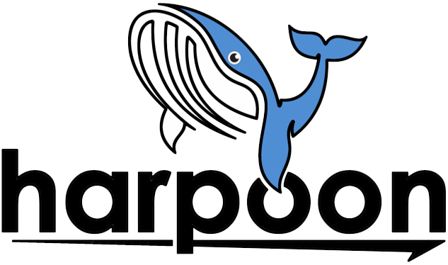

**harpoon** is a No Code Kubernetes platform that makes it insanely easy to build, deploy, and maintain software.
Deploying software shouldn't just be easy, it should be fun.

Contents
--------

.. toctree::
   :caption: Getting Started

   introduction
   features
   products
   usage

.. toctree::
   :caption: Integrations

   aws
   vmware
   dockerhub
   github
   harbor

.. toctree::
   :caption: Support

   troubleshooting
   support
